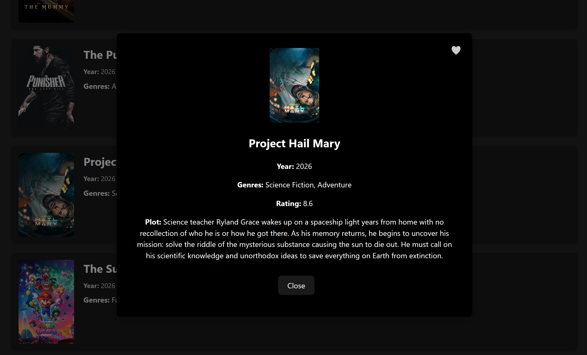
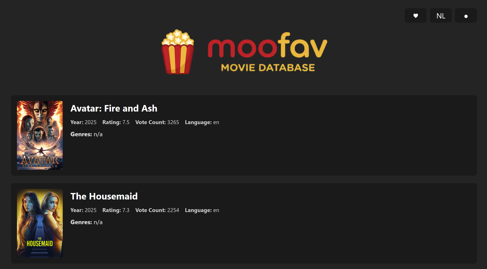
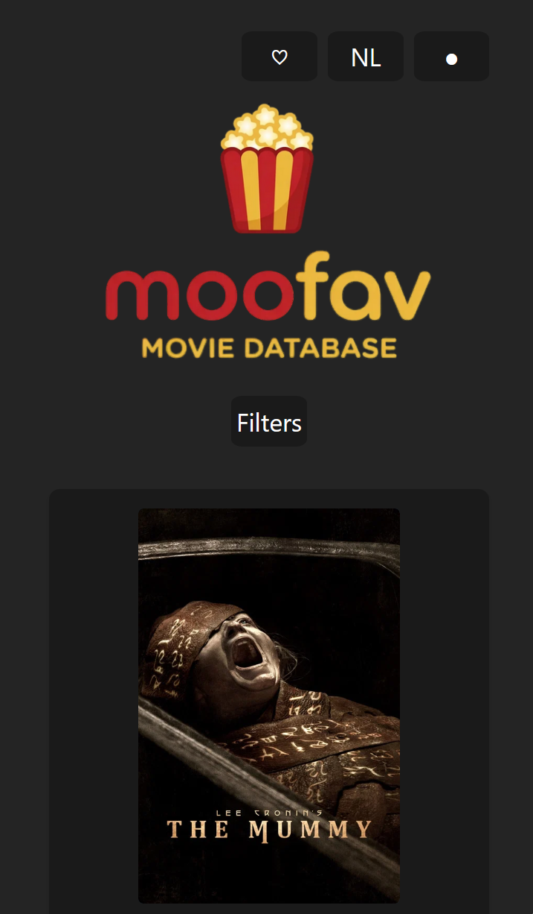

# Moofav - Movie Favorites Webapp README

## Projectbeschrijving en functionaliteiten

Moofav is een webapplicatie die gebruikers in staat stelt om nieuwe films te ontdekken en hun favoriete films bij te houden. De app maakt gebruik van een externe API (TMDB - The Movie Database API) om filmgegevens op te halen en biedt een intuïtieve interface voor gebruikers om hun instellingen en lievelingsfilms te beheren.

__voornaamste functionaliteiten:__
- Film ontdekken: gebruikers kunnen door een uitgebreide catalogus van films bladeren, gesorteerd op populariteit, release datum, genre, etc.
- Film details: gebruikers kunnen op een film klikken om meer informatie te zien, zoals de synopsis.
- Favorieten beheren: gebruikers kunnen films toevoegen aan hun favorietenlijst en deze lijst bekijken, bewerken of films ervan verwijderen.
- Meertalige ondersteuning: gebruikers kunnen de taal van de interface wijzigen tussen Engels en Nederlands.
- Thema toggle: gebruikers kunnen schakelen tussen een licht en donker thema voor een gepersonaliseerde ervaring.
- Search: gebruikers kunnen zoeken naar specifieke films met behulp van een zoekbalk.
- Filter opties: gebruikers kunnen de films filteren op genre, releasejaar, beoordeling, taal.
- Sorteren: gebruikers kunnen de lijst van films sorteren op populariteit, release datum, beoordeling, etc.
- Infinite scroll: gebruikers kunnen eindeloos scrollen door de filmcatalogus zonder handmatig pagina's te hoeven laden.
- Mobile responsive: de app is geoptimaliseerd voor gebruik op zowel desktop als mobiele apparaten, met een vereenvoudigde interface voor kleinere schermen.

## Gebruikte API's met links
- [The Movie Database (TMDb) API](https://developer.themoviedb.org/docs/getting-started)

## Technische vereisten

### DOM manipulatie
- Elementen selecteren
    - [src/ui/ui.js:99-116](src/ui/ui.js#L99-L116) (getAppElements: querySelector voor alle hoofd-UI elementen)
    - [src/ui/i18n.js:10-38](src/ui/i18n.js#L10-L38) (updateLanguage: querySelector voor labels, placeholders en sort options)
    - [src/ui/moviePopup.js:17-20](src/ui/moviePopup.js#L17-L20) (showMoviePopup: getElementById voor popup cleanup)
    - [src/ui/movieRenderer.js:60-63](src/ui/movieRenderer.js#L60-L63) (renderMovies: querySelector voor movie matrix)
    - [src/ui/movieRenderer.js:70](src/ui/movieRenderer.js#L70) (renderMovies: querySelectorAll voor movie items)
- Elementen manipuleren
    - [src/ui/i18n.js:10-38](src/ui/i18n.js#L10-L38) (updateLanguage: textContent manipulatie voor meertalige labels en opties)
    - [src/ui/filters.js:8-20](src/ui/filters.js#L8-L20) (setupThemeToggle: classList en textContent voor dynamic styling)
    - [src/ui/filters.js:72-90](src/ui/filters.js#L72-L90) (setupFavoritesToggle: style.display voor conditioneel tonen/verbergen)
    - [src/ui/moviePopup.js:17-49](src/ui/moviePopup.js#L17-L49) (showMoviePopup: createElement, innerHTML en appendChild)
    - [src/ui/movieRenderer.js:67](src/ui/movieRenderer.js#L67) (renderMovies: insertAdjacentHTML voor infinite scroll)
- Events aan elementen koppelen
    - [src/ui/i18n.js:46-60](src/ui/i18n.js#L46-L60) (setupLanguageToggle: addEventListener op language toggle)
    - [src/ui/filters.js:8-20](src/ui/filters.js#L8-L20) (setupThemeToggle: addEventListener op theme toggle)
    - [src/ui/filters.js:117-170](src/ui/filters.js#L117-L170) (setupSearchAndFilterListeners: addEventListener op search en filter dropdowns)
    - [src/ui/filters.js:72-90](src/ui/filters.js#L72-L90) (setupFavoritesToggle: addEventListener op favorites toggle)
    - [src/ui/moviePopup.js:53-64](src/ui/moviePopup.js#L53-L64) (showMoviePopup: onclick handlers op popup buttons)
    - [src/ui/moviePopup.js:66-70](src/ui/moviePopup.js#L66-L70) (showMoviePopup: addEventListener op popup backdrop)
    - [src/ui/movieRenderer.js:74-79](src/ui/movieRenderer.js#L74-L79) (renderMovies: addEventListener op movie items)

### Modern JavaScript
- Gebruik van constanten
    - [src/main.js:1-27](src/main.js#L1-L27) (module imports en constante module-wiring)
    - [src/main.js:31-32](src/main.js#L31-L32) (const elements en const state)
    - [src/state/state.js:17-29](src/state/state.js#L17-L29) (createInitialAppState: state object met vaste properties)
- Template literals
    - [src/ui/ui.js:17-77](src/ui/ui.js#L17-L77) (renderApp: grote HTML template)
    - [src/ui/moviePopup.js:38-48](src/ui/moviePopup.js#L38-L48) (showMoviePopup: template literal in popup.innerHTML)
    - [src/ui/movieRenderer.js:42-56](src/ui/movieRenderer.js#L42-L56) (renderMovies: template literal voor movie items)
    - [src/data/moviesApi.js:11-23](src/data/moviesApi.js#L11-L23) (buildTmdbUrl: template literal in URL construction)
- Iteratie over arrays
    - [src/ui/ui.js:125-132](src/ui/ui.js#L125-L132) (populateGenreOptions: forEach op genres)
    - [src/ui/ui.js:140-148](src/ui/ui.js#L140-L148) (populateYearOptions: for loop op jaren)
    - [src/ui/ui.js:157-164](src/ui/ui.js#L157-L164) (populateRatingOptions: for loop op ratings)
    - [src/ui/moviePopup.js:24-29](src/ui/moviePopup.js#L24-L29) (showMoviePopup: forEach op genre_ids)
- Array methodes
    - [src/data/favorites.js:40](src/data/favorites.js#L40) (removeFromFavorites: .filter() op favorites)
    - [src/data/favorites.js:26](src/data/favorites.js#L26) (addToFavorites/isFavorite: .includes() op array)
    - [src/ui/movieRenderer.js:17-57](src/ui/movieRenderer.js#L17-L57) (renderMovies: .map() op results)
    - [src/ui/movieRenderer.js:29-35](src/ui/movieRenderer.js#L29-L35) (renderMovies: .map().filter().join())
    - [src/ui/movieRenderer.js:76](src/ui/movieRenderer.js#L76) (renderMovies: .find() op data.results)
- Arrow functions
    - [src/main.js:52-65](src/main.js#L52-L65) (refreshMovies: arrow function als helper)
    - [src/ui/filters.js:15-20](src/ui/filters.js#L15-L20) (setupThemeToggle: arrow function in addEventListener)
    - [src/ui/ui.js:126-132](src/ui/ui.js#L126-L132) (populateGenreOptions: (genre) => {} in forEach)
    - [src/ui/movieRenderer.js:17](src/ui/movieRenderer.js#L17) (renderMovies: (movie) => {} in map)
    - [src/ui/movieRenderer.js:30-35](src/ui/movieRenderer.js#L30-L35) (renderMovies: (id) => {} in map)
    - [src/data/moviesApi.js:90-95](src/data/moviesApi.js#L90-L95) (fetchMoviesByIds: (id) => {} in map voor favorites)
    - [src/ui/scrolling.js:21-23](src/ui/scrolling.js#L21-L23) (setupInfiniteScroll: (morePagesToLoad) => {} in .then())
- Conditional (ternary) operator (moderne if..else)
    - [src/ui/i18n.js:56](src/ui/i18n.js#L56) (setupLanguageToggle: ternary in language toggle)
    - [src/ui/filters.js:18-19](src/ui/filters.js#L18-L19) (setupThemeToggle: ternary voor isLight check en localStorage)
    - [src/ui/filters.js:81](src/ui/filters.js#L81) (setupFavoritesToggle: ternary voor favorites icon)
    - [src/data/favorites.js:7](src/data/favorites.js#L7) (getFavorites: ternary met fallback)
    - [src/ui/moviePopup.js:40-46](src/ui/moviePopup.js#L40-L46) (showMoviePopup: ternary operators in template literal)
    - [src/ui/movieRenderer.js:23-24](src/ui/movieRenderer.js#L23-L24) (renderMovies: ternary in movie details)
- Callback functions
    - [src/ui/i18n.js:54-60](src/ui/i18n.js#L54-L60) (setupLanguageToggle: callback in addEventListener)
    - [src/ui/filters.js:15-20](src/ui/filters.js#L15-L20) (setupThemeToggle: callback in addEventListener)
    - [src/ui/filters.js:117-151](src/ui/filters.js#L117-L151) (setupSearchAndFilterListeners: callbacks op input/select listeners)
    - [src/ui/moviePopup.js:54-60](src/ui/moviePopup.js#L54-L60) (showMoviePopup: onclick callbacks op buttons)
    - [src/ui/scrolling.js:21-23](src/ui/scrolling.js#L21-L23) (setupInfiniteScroll: callback in .then())
    - [src/main.js:113-116](src/main.js#L113-L116) (refreshMovies(1).then(): callback chain)
- Promises
    - [src/data/moviesApi.js:89-95](src/data/moviesApi.js#L89-L95) (fetchMoviesByIds: Promise.all() voor favorites)
    - [src/main.js:113-116](src/main.js#L113-L116) (refreshMovies(1).then(): Promise chain)
    - [src/ui/scrolling.js:20](src/ui/scrolling.js#L20) (setupInfiniteScroll: Promise.resolve(onLoadMore()))
- Async & Await
    - [src/main.js:41](src/main.js#L41) (bootstrap in main: const genres = await getMovieGenres())
    - [src/data/fetch.js:11-16](src/data/fetch.js#L11-L16) (getMovieGenres: async functie)
    - [src/data/moviesApi.js:30-35](src/data/moviesApi.js#L30-L35) (fetchJson: await fetch en return response.json())
- Observer API (1 is voldoende)
    - [src/ui/scrolling.js:10-38](src/ui/scrolling.js#L10-L38) (setupInfiniteScroll: new IntersectionObserver() voor infinite scroll)

### Data & API
- Fetch om data op te halen
    - [src/data/moviesApi.js:30-35](src/data/moviesApi.js#L30-L35) (fetchJson: fetch() met async/await)
- JSON manipuleren en weergeven
    - [src/ui/i18n.js:1](src/ui/i18n.js#L1) (translationsData import uit dictionary.json)
    - [src/data/favorites.js:7](src/data/favorites.js#L7) (getFavorites: JSON.parse() van localStorage)
    - [src/data/favorites.js:15-16](src/data/favorites.js#L15-L16) (saveFavorites: JSON.stringify() naar localStorage)
    - [src/data/moviesApi.js:35](src/data/moviesApi.js#L35) (fetchJson: response.json())

### Opslag & validatie
- Formulier validatie
    - [src/ui/filters.js:141](src/ui/filters.js#L141) (setupSearchAndFilterListeners: search input validatie met .trim())
    - [src/data/favorites.js:24-30](src/data/favorites.js#L24-L30) (addToFavorites: .includes() validatie of favoriet bestaat)
    - [src/data/favorites.js:38-40](src/data/favorites.js#L38-L40) (removeFromFavorites: .filter() validatie op favorites)
- Gebruik van LocalStorage
    - [src/ui/i18n.js:47](src/ui/i18n.js#L47) (setupLanguageToggle: localStorage.getItem('language'))
    - [src/ui/i18n.js:58](src/ui/i18n.js#L58) (setupLanguageToggle: localStorage.setItem('language', newLanguage))
    - [src/ui/filters.js:9](src/ui/filters.js#L9) (setupThemeToggle: localStorage.getItem('theme'))
    - [src/ui/filters.js:19](src/ui/filters.js#L19) (setupThemeToggle: localStorage.setItem('theme', isLight ? 'light' : 'dark'))
    - [src/data/favorites.js:6](src/data/favorites.js#L6) (getFavorites: localStorage.getItem('moofav-favorites'))
    - [src/data/favorites.js:16](src/data/favorites.js#L16) (saveFavorites: localStorage.setItem('moofav-favorites'))

### Styling & layout
- Basis HTML layout (flexbox of CSS grid kan hiervoor worden gebruikt)
    - [src\css\style.css:119](src/css/style.css#L119) (styling van de movie matrix met flexbox)
- Basis CSS
    - [src/css/style.css](src/css/style.css) (algemene styling van de app)
- Gebruiksvriendelijke elementen (verwijderknoppen, icoontjes, ...)
    - [src/css/style.css:88-112](src/css/style.css#L88-L112) (styling van de movie popup met knoppen en icoontjes)
    - [src/ui/ui.js:17-24](src/ui/ui.js#L17-L24) (renderApp: heart- en dot/circle-icoontjes voor UI toggles)
    - [src/ui/filters.js:81](src/ui/filters.js#L81) (setupFavoritesToggle: heart-icoon bij favorieten)

### Tooling & structuur
- Project is opgezet met Vite
    - [package.json:12](package.json#L12) (Vite dependencies)
- Een correcte folderstructuur wordt aangehouden (gescheiden html, css en js files, src folder, dist folder, ...)
    - [index.html](index.html) (HTML bestand)
    - [src/](src)
        - [main.js](src/main.js) (orchestrator / bootstrap)
        - [css/](src/css) (CSS bestanden)
        - [ui/](src/ui) (UI modules)
            - [ui.js](src/ui/ui.js) (UI rendering + element access)
            - [i18n.js](src/ui/i18n.js) (taalbeheer)
            - [filters.js](src/ui/filters.js) (filters + toggles)
            - [moviePopup.js](src/ui/moviePopup.js) (movie popup rendering + logic)
            - [movieRenderer.js](src/ui/movieRenderer.js) (movie grid rendering)
            - [scrolling.js](src/ui/scrolling.js) (infinite scroll)
        - [state/](src/state) (state management)
            - [state.js](src/state/state.js) (centrale state)
        - [data/](src/data) (data handling)
            - [favorites.js](src/data/favorites.js) (favorites management)
            - [fetch.js](src/data/fetch.js) (data orchestration)
            - [moviesApi.js](src/data/moviesApi.js) (API requests)

## Installatiehandleiding

1. Clone de repository: `git clone https://github.com/jgeeliss/moofav.git`
2. Navigeer naar de projectmap: `cd moofav`
3. Installeer de dependencies: `npm install`
4. Start de ontwikkelserver: `npm run dev`
5. Open de applicatie in je browser via de gegeven localhost URL (meestal http://localhost:5173)

voor een productie build:
1. Bouw de applicatie: `npm run build`
2. Preview de productie build: `npm run preview`

## Screenshots van de applicatie

")
")

## Gebruikte bronnen
- [chatlog met AI](./chatbot-conversation.md)
- [Detect browser viewport size change using JavaScript's matchMedia method](https://stackoverflow.com/questions/76639699/how-to-detect-browser-viewport-size-change-using-javascripts-matchmedia-method)
- [JavaScript module system for state management](https://krasimirtsonev.com/blog/article/javascript-module-system-for-state-management)
- [Building an infinite scroll component with IntersectionObserver](https://dev.to/vikas2426/building-an-infinite-scroll-component-with-intersection-observer-17p1)
- [The Movie Database API documentation](https://developer.themoviedb.org/docs/getting-started)
- [Toggling localStorage item](https://stackoverflow.com/questions/64843820/toggling-localstorage-item)
- [Web search bar implementation using JavaScript conditional flow](https://www.geeksforgeeks.org/javascript/web-search-bar-implementation-using-javascript-conditional-flow/)
- [Using JavaScript to change website language](https://stackoverflow.com/questions/32008125/using-javascript-to-change-website-language)
- [The best folder structure for JavaScript developers building large projects](https://medium.com/@dappinity_technologies/the-best-folder-structure-for-javascript-developers-building-large-projects-986bde27239d)
